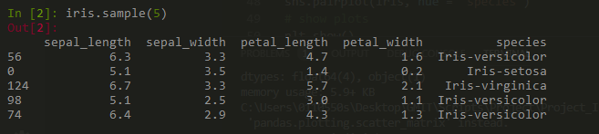
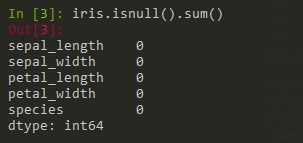
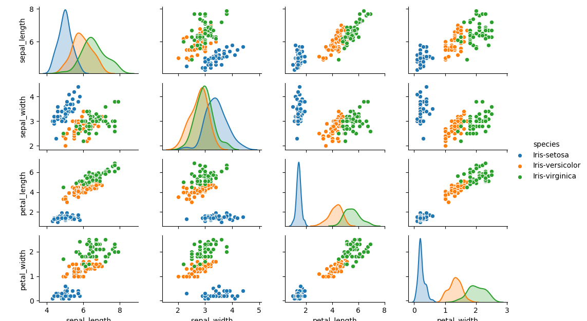
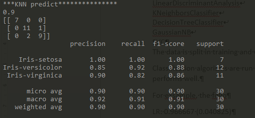

## Vitalis Smirnovs
### Student ID # G00317774
### GMIT 2019
### Lecturer @Ian McLoughlin (https://github.com/ianmcloughlin)
#  Project: Iris Data Analysis

### Project Plan:
1. Data Description
2. Descriptive Statistics
3. Further Data Analysis
4. References

### 1. Data Description
Iris flower data set is a well-known multivariate data set created by British statistician and biologist Ronald Fisher back in 1936 to demonstrate the work of the discriminant analysis method developed by him 
Alsow data called Anderson's Iris data set because Edgar Anderson as a botanist collected the data to quantify the morphologic variation of Iris flowers.[1] 

Fisher’s method became worldwide known data set example for data mining and data exploration for statisticians, mathematicians, programmers etc. Iris data set contains three different flower classes with numeric values for sepal and petal width and length.  [2]

The data set collected from three iris species (iris versicolor, iris setosa and iris virginica) and contained 150 records 50 each where flowers sepals and petals width and length measured in centimetres and all the species data carefully collected end measured for each flower.[1]

Traditionally this data set used for prediction, classification to identify the flowers as a certain type of irises. By visually observing this data you could see how data grouping in cluster with these three different types of irises. This data set has become a classic, and is often used in the literature to illustrate the work of various statistical algorithms.[3]

### 2. Descriptive Statistics
To view data set – top 5 lines:

 
To view data set last 5 lines:

View 5 random rows from the data set [5]:

Is there any null data in our data set? [5]:

 
To gain basic info on data:

 
Basic stats of the numeric variables: shows number of observations, averages, standard deviation, min, max and 25th, 50th and 75th percentalies.
 
 

### 3. Further Analysis

Box plot visualises statistic data average, median, min, max, percentiles.  It allows one to quickly determine if the averages are representative. It also plots so-called outliers (circles on the plot).[4]

     iris.plot(kind="box")
     iris.hist()
     scatter_matrix(iris)
     sns.pairplot(iris, hue = 'species')
     plt.show()

 
Histogram is another way to gain insights into data distribution. 

This is important as some statistical analysis requires normal distribution of data. The only variable that approximates normal distribution is sepal_width. Petal_length and petal_width variables have a very strange distribution. It looks like two different data sets. 

Adding scatter plots helps to see further that parts of data on all variables stands separetely. The graph below  
Similar graph is available in seaborn module. It’s a matter of personal preference but it looks a bit better. searborn.scatter() allows to display the following: 

Seaborn.scatter( by speacies) allows to separate data on a scatter plot with different colour for species.. Right away it is obvious that data for different species clusters together. Iris setosa stands apart on all dimensions.

 
Iris data set is very useful in testing classification algorisms in machine learning. 

The following algorisms were used for this project, Python code adapted from [5]:
 &ensp; 1. Logistic Regression \
 &ensp; 2. Linear Discriminant Analysis \
 &ensp; 3. KNeighbors Classifier \
 &ensp; 4. Decision Tree Classifier \
 &ensp; 5. Gaussian NB \
 &ensp; 6. SVC \
In calssification algorithms the data is split in training and validation parts. Classification algorisms are run on training part of data. The matrix allows to see which algorism performs well.[6]

For example, the following is the output from all training algorisms:

    # from:https://medium.com/codebagng/basic-analysis-of-the-iris-data-set-using-python-2995618a6342
    # Split-out validation dataset
    array = iris.values
    X = array[:,0:4]
    Y = array[:,4]
    validation_size = 0.20
    seed = 7
    X_train, X_validation, Y_train, Y_validation = model_selection.train_test_split(X, Y, test_size=validation_size, random_state=seed)
    # Test options and evaluation metric
    seed = 7
    scoring = 'accuracy'
    # Spot Check Algorithms
    models = []
    models.append(('LR', LogisticRegression()))
    models.append(('LDA', LinearDiscriminantAnalysis()))
    models.append(('KNN', KNeighborsClassifier()))
    models.append(('CART', DecisionTreeClassifier()))
    models.append(('NB', GaussianNB()))
    models.append(('SVM', SVC()))
    # evaluate each model in turn
    results = []
    names = []
    for name, model in models:
     kfold = model_selection.KFold(n_splits=10, random_state=seed)
     cv_results = model_selection.cross_val_score(model, X_train, Y_train, cv=kfold, scoring=scoring)
     results.append(cv_results)
     names.append(name)
     msg = "%s: %f (%f)" % (name, cv_results.mean(), cv_results.std())
     print(msg)

&ensp; LR: 0.966667 (0.040825) \
&ensp; LDA: 0.975000 (0.038188) \
&ensp; KNN: 0.983333 (0.033333) \
&ensp; CART: 0.966667 (0.040825) \
&ensp; NB: 0.975000 (0.053359) \
&ensp; SVM: 0.991667 (0.025000) 

KNN and SVM seem to be performing very well. These can be used to make predictions:
KNN predicts with 90% accuracy:

While SVM has 93% accuracy:

### This repository contains related documents:

 1) See the script for data analysis is in Project_Iris.py
 2) Images used in this analysis - output generated in ipython
 

## References:
1. https://en.wikipedia.org/wiki/Iris_flower_data_set
2. https://en.wikipedia.org/wiki/Analysis_of_variance
3. https://medium.com/@livingwithdata/exploring-the-iris-dataset-260cc1e5cdf7
4. https://towardsdatascience.com/understanding-boxplots-5e2df7bcbd51
5. https://medium.com/codebagng/basic-analysis-of-the-iris-data-set-using-python-2995618a6342
6. https://en.wikipedia.org/wiki/Training,_validation,_and_test_sets
7. A number of Iris Data Analysis project were consulted on www.kaggel.com these helped in planning this project.

